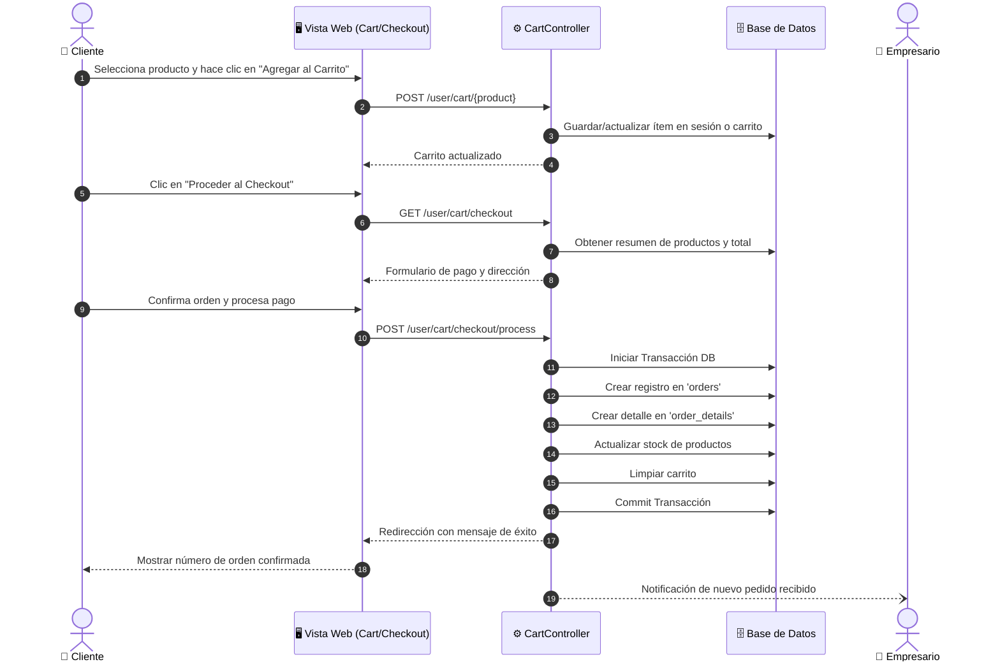
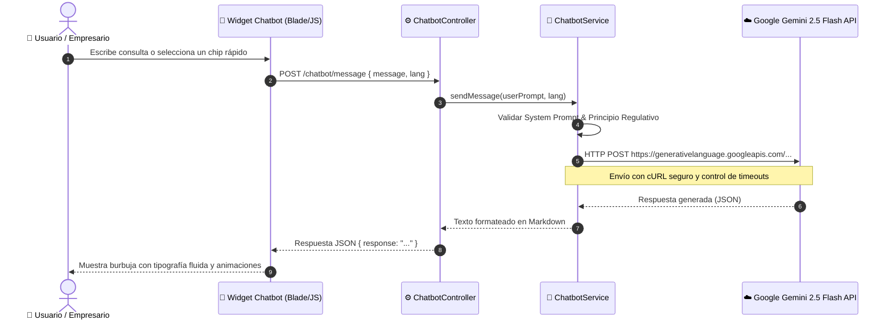

# 📋 Especificación de Casos de Uso - Visory Shop (Spotlight)

Documento formal de especificación y modelado de Casos de Uso para el sistema **Visory Shop (Spotlight)**, desarrollado sobre Laravel 12, MySQL, Bootstrap 5 e integración con IA (Google Gemini).

---

## 👥 Actores del Sistema

| Actor | Tipo | Descripción |
| :--- | :--- | :--- |
| **Visitante (Guest)** | Humano | Usuario no autenticado que explora el marketplace, productos y perfiles de empresas. |
| **Cliente (User)** | Humano | Usuario registrado con rol de comprador; gestiona carrito, compras, pedidos y mapa. |
| **Empresario (Business)** | Humano | Vendedor encargado de administrar el catálogo de productos, empresa y gastos operativos. |
| **Administrador (Admin)** | Humano | Superusuario responsable de la moderación, gestión de usuarios, auditoría y reportes. |
| **Servicio Google OAuth** | Externo / Sistema | Proveedor de autenticación social federada. |
| **Servicio de Correo (SMTP)**| Externo / Sistema | Emisor de correos y códigos de verificación OTP. |
| **API Google Gemini (IA)** | Externo / Sistema | Motor de procesamiento de lenguaje natural y asistencia inteligente. |

---

## 🗺️ Diagrama General de Casos de Uso (Mermaid)

```mermaid
flowchart TB
    %% Actores
    subgraph Actores ["👥 Actores"]
        A_Guest["👤 Visitante"]
        A_User["🛒 Cliente"]
        A_Business["🏢 Empresario"]
        A_Admin["🛡️ Administrador"]
    end

    %% Módulo Autenticación
    subgraph Mod_Auth ["🔐 Módulo de Autenticación y Cuenta"]
        CU01(["CU01: Registrarse"])
        CU02(["CU02: Iniciar Sesión"])
        CU03(["CU03: Autenticación con Google"])
        CU04(["CU04: Verificar Código OTP Email"])
        CU05(["CU05: Cerrar Sesión"])
        CU06(["CU06: Actualizar Perfil"])
    end

    %% Módulo Marketplace y Compra
    subgraph Mod_Commerce ["🛍️ Módulo Marketplace y Compras"]
        CU07(["CU07: Explorar Catálogo y Empresas"])
        CU08(["CU08: Ver Geolocalización en Mapa"])
        CU09(["CU09: Gestionar Carrito de Compras"])
        CU10(["CU10: Checkout y Procesamiento de Pago"])
        CU11(["CU11: Consultar Historial de Pedidos"])
    end

    %% Módulo Gestión Empresarial
    subgraph Mod_Business ["📈 Módulo de Gestión Empresarial"]
        CU12(["CU12: Gestionar Perfil de Empresa"])
        CU13(["CU13: Solicitar Actualización de Documentos"])
        CU14(["CU14: Gestionar Productos (CRUD)"])
        CU15(["CU15: Gestionar Gastos Operativos (CRUD)"])
        CU16(["CU16: Visualizar Dashboard Empresarial"])
    end

    %% Módulo Administración
    subgraph Mod_Admin ["⚙️ Módulo de Administración"]
        CU17(["CU17: Administrar Usuarios"])
        CU18(["CU18: Administrar y Auditar Empresas"])
        CU19(["CU19: Moderar Productos de Tiendas"])
        CU20(["CU20: Consultar Reportes y Métricas"])
        CU21(["CU21: Visualizar Dashboard General"])
    end

    %% Módulo Comunicación e IA
    subgraph Mod_Communication ["💬 Comunicación e Inteligencia Artificial"]
        CU22(["CU22: Mensajería Directa (Chat)"])
        CU23(["CU23: Consultar Asistente IA (Spotlight)"])
    end

    %% Relaciones Visitante
    A_Guest --> CU01
    A_Guest --> CU02
    A_Guest --> CU03
    A_Guest --> CU07

    %% Relaciones Cliente
    A_User --> CU04
    A_User --> CU05
    A_User --> CU06
    A_User --> CU07
    A_User --> CU08
    A_User --> CU09
    A_User --> CU10
    A_User --> CU11
    A_User --> CU22
    A_User --> CU23

    %% Relaciones Empresario
    A_Business --> CU05
    A_Business --> CU12
    A_Business --> CU13
    A_Business --> CU14
    A_Business --> CU15
    A_Business --> CU16
    A_Business --> CU22
    A_Business --> CU23

    %% Relaciones Administrador
    A_Admin --> CU05
    A_Admin --> CU17
    A_Admin --> CU18
    A_Admin --> CU19
    A_Admin --> CU20
    A_Admin --> CU21
    A_Admin --> CU22
```

---

## 🔄 Diagrama de Secuencia: Flujo de Compra y Checkout

---

## 🤖 Diagrama de Secuencia: Interacción con Asistente IA (Gemini)

---

## 📑 Catálogo Detallado de Casos de Uso

### Módulo 1: Autenticación y Gestión de Cuenta

#### CU01: Registrarse en la Plataforma
- **Actor:** Visitante (Guest)
- **Precondición:** El visitante no debe tener sesión activa.
- **Flujo Principal:**
  1. El visitante accede a la ruta `/register`.
  2. Completa el formulario con nombre, correo, contraseña y selección de rol inicial.
  3. El sistema valida las reglas de entrada (formato de correo, complejidad de contraseña).
  4. El sistema crea el usuario y redirige al panel según su rol o solicita verificación.
- **Flujo Alternativo:** Si el correo ya existe, muestra mensaje de error.

#### CU02: Iniciar Sesión con Credenciales
- **Actor:** Visitante (Guest)
- **Precondición:** Usuario registrado en el sistema.
- **Flujo Principal:**
  1. El usuario accede a `/login`.
  2. Ingresa sus credenciales y presiona "Ingresar".
  3. El sistema valida contra la base de datos y genera la sesión.
  4. Redirección según rol:
     - Administrador $\rightarrow$ `/admin/dashboard`
     - Empresario $\rightarrow$ `/business/dashboard`
     - Cliente $\rightarrow$ `/user/dashboard`
- **Flujo Alternativo:** Credenciales erróneas incrementan contador de intentos y muestran mensaje de advertencia.

#### CU03: Autenticación Social con Google OAuth
- **Actor:** Visitante / Usuario
- **Flujo Principal:**
  1. El usuario hace clic en "Continuar con Google".
  2. El sistema redirige al consentimiento de Google Accounts (`/auth/google/redirect`).
  3. Google retorna el token y los datos de perfil a `/auth/google/callback`.
  4. Si el usuario no existe, se crea automáticamente con correo verificado o se envía código OTP complementario según la política de seguridad.

#### CU04: Verificación de Correo con Código OTP
- **Actor:** Cliente / Usuario recién registrado con Google
- **Flujo Principal:**
  1. El sistema genera un código numérico aleatorio y lo envía al correo vía `GoogleVerificationMail`.
  2. El usuario accede a `/verify-email/codigo`.
  3. Digita el código y envía el formulario.
  4. El sistema valida coincidencia y vigencia del código y activa la cuenta completamente.

---

### Módulo 2: Cliente y Marketplace

#### CU07: Explorar Catálogo y Tiendas
- **Actor:** Visitante / Cliente
- **Descripción:** Visualización de productos con filtros por categoría, búsqueda por texto y acceso al perfil público de cada empresa (`/empresas/{company}`) con tooltip flotante de contacto.

#### CU08: Mapa Interactivo de Comercios
- **Actor:** Cliente
- **Descripción:** Acceso a `/user/map` donde se visualizan geolocalizadas las tiendas y puntos de venta en un mapa interactivo.

#### CU09: Gestión del Carrito de Compras
- **Actor:** Cliente
- **Descripción:** Permite agregar ítems, incrementar/decrementar cantidades y remover productos del pedido en preparación.

#### CU10: Checkout y Pago de Orden
- **Actor:** Cliente
- **Precondición:** El carrito contiene al menos un producto con stock disponible.
- **Flujo Principal:**
  1. El usuario ingresa a `/user/cart/checkout`.
  2. Proporciona datos de envío y confirma método de pago.
  3. El sistema procesa la transacción de base de datos, reduce existencias y genera el pedido.

---

### Módulo 3: Gestión Empresarial (Business)

#### CU12: Gestionar Información de la Empresa
- **Actor:** Empresario
- **Descripción:** Configurar nombre comercial, descripción, dirección física, coordenadas geográficas, teléfono y logo.

#### CU13: Solicitar Actualización de Documentación
- **Actor:** Empresario
- **Descripción:** Cargar documentos legales/tributarios para validación y aprobación por parte del Administrador.

#### CU14: Catálogo de Productos del Negocio
- **Actor:** Empresario
- **Descripción:** Operaciones CRUD sobre los productos que ofrece la tienda (nombre, precio, stock, imagen, descripción y visibilidad).

#### CU15: Registro y Control de Gastos
- **Actor:** Empresario
- **Descripción:** Registrar egresos y costos operativos del comercio (`/business/expenses`) para el cálculo de rentabilidad.

---

### Módulo 4: Administración del Sistema

#### CU17: Administración de Usuarios
- **Actor:** Administrador
- **Descripción:** Listado con paginación, filtros de rol, creación manual, edición y activación/desactivación instantánea (`users.toggle`).

#### CU18: Auditoría y Moderación de Empresas
- **Actor:** Administrador
- **Descripción:** Habilitar/suspender empresas, revisar documentos legales cargados y aprobar estados de actualización de expediente.

#### CU19: Moderación de Productos
- **Actor:** Administrador
- **Descripción:** Supervisar productos publicados en el marketplace y desactivar o eliminar ítems que incumplan políticas de la plataforma.

#### CU20: Reportes y Métricas Globales
- **Actor:** Administrador
- **Descripción:** Consultar estadísticas de ventas globales, métricas de actividad de comercios y desempeño de la plataforma.

---

### Módulo 5: Mensajería e Inteligencia Artificial

#### CU22: Chat entre Usuarios y Vendedores
- **Actor:** Cliente, Empresario, Administrador
- **Descripción:** Canal de mensajería interna directa para resolver dudas sobre productos, coordinar entregas o soporte post-venta, con contador dinámico de mensajes no leídos.

#### CU23: Asistente Virtual IA (Spotlight Bot)
- **Actor:** Cliente, Empresario, Administrador
- **Descripción:** Asistente interactivo basado en Google Gemini 2.5 Flash con:
  - Detección automática o selector manual de idioma (Español / Inglés).
  - Sugerencias rápidas predefinidas (Quick chips).
  - Filosofía institucional regulativa integrada en el System Prompt.
  - Respuestas formateadas en Markdown enriquecido.

---

## 📊 Matriz de Trazabilidad (Roles vs Casos de Uso)

| ID Caso de Uso | Caso de Uso | Visitante | Cliente | Empresario | Admin |
| :---: | :--- | :---: | :---: | :---: | :---: |
| **CU01** | Registro en plataforma | ✅ | ❌ | ❌ | ❌ |
| **CU02** | Inicio de sesión | ✅ | ❌ | ❌ | ❌ |
| **CU03** | Autenticación Google OAuth | ✅ | ❌ | ❌ | ❌ |
| **CU04** | Verificación OTP Email | ❌ | ✅ | ❌ | ❌ |
| **CU05** | Cerrar Sesión | ❌ | ✅ | ✅ | ✅ |
| **CU06** | Actualizar Perfil | ❌ | ✅ | ❌ | ❌ |
| **CU07** | Explorar Marketplace / Empresas | ✅ | ✅ | ✅ | ✅ |
| **CU08** | Ver Mapa de Comercios | ❌ | ✅ | ❌ | ❌ |
| **CU09** | Gestión de Carrito | ❌ | ✅ | ❌ | ❌ |
| **CU10** | Checkout y Pago | ❌ | ✅ | ❌ | ❌ |
| **CU11** | Historial de Pedidos | ❌ | ✅ | ❌ | ❌ |
| **CU12** | Editar Perfil de Empresa | ❌ | ❌ | ✅ | ❌ |
| **CU13** | Solicitud Actualización Docs | ❌ | ❌ | ✅ | ❌ |
| **CU14** | CRUD Productos de Tienda | ❌ | ❌ | ✅ | ❌ |
| **CU15** | CRUD Gastos Operativos | ❌ | ❌ | ✅ | ❌ |
| **CU16** | Dashboard Empresario | ❌ | ❌ | ✅ | ❌ |
| **CU17** | Gestión de Usuarios | ❌ | ❌ | ❌ | ✅ |
| **CU18** | Gestión y Auditoría Empresas | ❌ | ❌ | ❌ | ✅ |
| **CU19** | Moderación de Productos | ❌ | ❌ | ❌ | ✅ |
| **CU20** | Reportes del Sistema | ❌ | ❌ | ❌ | ✅ |
| **CU21** | Dashboard Administrador | ❌ | ❌ | ❌ | ✅ |
| **CU22** | Mensajería Directa (Chat) | ❌ | ✅ | ✅ | ✅ |
| **CU23** | Asistente Virtual con IA | ❌ | ✅ | ✅ | ✅ |
